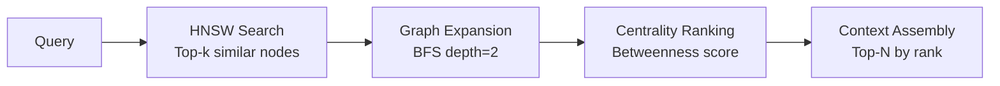

# GraphRAG Cookbook

This cookbook demonstrates the **GraphRAG retrieval pattern** using all five of muninn's subsystems together. The pattern: start with vector similarity search, expand through graph traversal, rank by centrality, and assemble context using community structure.

## The GraphRAG Pattern

Traditional RAG retrieves chunks by embedding similarity alone. GraphRAG adds a **graph expansion** step that surfaces related context the embedding search would miss:

```
Query → VSS (top-k similar) → Graph Expansion → Centrality Ranking → Context Assembly
```



## Setup: A Knowledge Graph

This example builds a small knowledge graph of concepts and relationships, then demonstrates the full GraphRAG retrieval pipeline.

### Step 1: Create the Schema

```sql
.load ./muninn

-- Concepts with their embeddings
CREATE VIRTUAL TABLE concept_vectors USING hnsw_index(
    dimensions=64, metric='cosine'
);

-- Concept metadata
CREATE TABLE concepts (
    id INTEGER PRIMARY KEY,
    name TEXT UNIQUE,
    description TEXT
);

-- Relationships between concepts
CREATE TABLE relationships (
    src TEXT NOT NULL,
    dst TEXT NOT NULL,
    relation TEXT NOT NULL,
    weight REAL DEFAULT 1.0
);
```

### Step 2: Populate (Python)

```python
import sqlite3
import struct
import random

db = sqlite3.connect("knowledge.db")
db.enable_load_extension(True)
db.load_extension("./muninn")

# Insert concepts with random embeddings (replace with real embeddings in production)
dim = 64
concepts = [
    (1, "machine_learning", "Statistical methods for pattern recognition"),
    (2, "neural_networks", "Layered computational models inspired by biology"),
    (3, "transformers", "Attention-based sequence models"),
    (4, "embeddings", "Dense vector representations of discrete objects"),
    (5, "knowledge_graphs", "Structured representations of entities and relations"),
    (6, "graph_databases", "Storage systems optimized for connected data"),
    (7, "sqlite", "Embedded relational database engine"),
    (8, "vector_search", "Finding similar items by embedding distance"),
    (9, "rag", "Retrieval-Augmented Generation for LLMs"),
    (10, "community_detection", "Algorithms for finding graph clusters"),
]

for cid, name, desc in concepts:
    db.execute("INSERT INTO concepts VALUES (?, ?, ?)", (cid, name, desc))
    vec = [random.gauss(0, 1) for _ in range(dim)]
    blob = struct.pack(f'{dim}f', *vec)
    db.execute("INSERT INTO concept_vectors(rowid, vector) VALUES (?, ?)", (cid, blob))

# Insert relationships
relationships = [
    ("machine_learning", "neural_networks", "includes"),
    ("neural_networks", "transformers", "evolved_into"),
    ("transformers", "embeddings", "produces"),
    ("embeddings", "vector_search", "enables"),
    ("knowledge_graphs", "graph_databases", "stored_in"),
    ("graph_databases", "sqlite", "implemented_with"),
    ("vector_search", "rag", "used_by"),
    ("knowledge_graphs", "rag", "used_by"),
    ("embeddings", "knowledge_graphs", "represents"),
    ("community_detection", "knowledge_graphs", "analyzes"),
    ("machine_learning", "community_detection", "includes"),
]

db.executemany(
    "INSERT INTO relationships VALUES (?, ?, ?, 1.0)",
    [(s, d, r) for s, d, r in relationships],
)
db.commit()
```

### Step 3: Retrieval Pipeline

#### Phase 1 — Vector Similarity Search

Find the top-k concepts most similar to the query embedding:

```sql
-- Search for concepts related to the query
SELECT rowid, distance FROM concept_vectors
WHERE vector MATCH ?query_embedding AND k = 3;
-- Returns e.g.: (4, 0.12), (8, 0.18), (5, 0.23)
-- → embeddings, vector_search, knowledge_graphs
```

#### Phase 2 — Graph Expansion

For each seed node from VSS, expand via BFS to discover related concepts:

```sql
-- Expand from 'embeddings' (seed node from VSS)
SELECT node, depth, parent FROM graph_bfs
WHERE edge_table = 'relationships' AND src_col = 'src' AND dst_col = 'dst'
  AND start_node = 'embeddings' AND max_depth = 2 AND direction = 'both';
```

This surfaces concepts like `transformers`, `knowledge_graphs`, and `rag` that may not have been close in embedding space but are structurally related.

#### Phase 3 — Centrality Ranking

Rank the expanded node set by betweenness centrality to find the most structurally important concepts:

```sql
-- Compute betweenness centrality for the full graph
SELECT node, centrality FROM graph_betweenness
WHERE edge_table = 'relationships' AND src_col = 'src' AND dst_col = 'dst'
  AND direction = 'both'
ORDER BY centrality DESC;
```

High-betweenness nodes like `embeddings` and `knowledge_graphs` act as **bridge concepts** connecting different topic clusters — these provide the most valuable cross-domain context.

#### Phase 4 — Community-Aware Assembly

Use Leiden communities to ensure the final context covers multiple topic areas:

```sql
-- Detect communities
SELECT node, community_id, modularity FROM graph_leiden
WHERE edge_table = 'relationships' AND src_col = 'src' AND dst_col = 'dst';
```

Select the top-centrality node from **each community** that overlaps with the expanded node set. This prevents the context from being dominated by a single cluster.

## Full Pipeline in Python

```python
import struct

def graphrag_retrieve(db, query_embedding, dim=64, k=3, expansion_depth=2, top_n=5):
    """Full GraphRAG retrieval pipeline."""
    query_blob = struct.pack(f'{dim}f', *query_embedding)

    # Phase 1: VSS seed nodes
    seeds = db.execute(
        "SELECT rowid, distance FROM concept_vectors "
        "WHERE vector MATCH ? AND k = ?",
        (query_blob, k)
    ).fetchall()

    seed_names = {
        db.execute("SELECT name FROM concepts WHERE id = ?", (s[0],)).fetchone()[0]
        for s in seeds
    }

    # Phase 2: Graph expansion from each seed
    expanded = set()
    for name in seed_names:
        neighbors = db.execute(
            "SELECT node FROM graph_bfs "
            "WHERE edge_table = 'relationships' AND src_col = 'src' AND dst_col = 'dst' "
            "  AND start_node = ? AND max_depth = ? AND direction = 'both'",
            (name, expansion_depth)
        ).fetchall()
        expanded.update(n[0] for n in neighbors)

    # Phase 3: Rank by betweenness centrality
    centrality = db.execute(
        "SELECT node, centrality FROM graph_betweenness "
        "WHERE edge_table = 'relationships' AND src_col = 'src' AND dst_col = 'dst' "
        "  AND direction = 'both'"
    ).fetchall()
    centrality_map = {n: c for n, c in centrality}

    ranked = sorted(expanded, key=lambda n: centrality_map.get(n, 0), reverse=True)

    # Phase 4: Community-aware selection (at least one node per community)
    communities = db.execute(
        "SELECT node, community_id FROM graph_leiden "
        "WHERE edge_table = 'relationships' AND src_col = 'src' AND dst_col = 'dst'"
    ).fetchall()
    community_map = {n: c for n, c in communities}

    selected = []
    seen_communities = set()
    for node in ranked:
        comm = community_map.get(node)
        if comm not in seen_communities or len(selected) < top_n:
            selected.append(node)
            if comm is not None:
                seen_communities.add(comm)
        if len(selected) >= top_n:
            break

    # Fetch descriptions for context
    context = []
    for node in selected:
        row = db.execute(
            "SELECT name, description FROM concepts WHERE name = ?", (node,)
        ).fetchone()
        if row:
            context.append({"name": row[0], "description": row[1],
                           "centrality": centrality_map.get(node, 0)})

    return context
```

## Adding Node2Vec for Structural Similarity

Node2Vec can complement content embeddings by capturing **structural** similarity. Two nodes with different content but similar graph positions (e.g., both are hub nodes) will be close in Node2Vec space.

```sql
-- Create structural embedding index
CREATE VIRTUAL TABLE structural_emb USING hnsw_index(
    dimensions=64, metric='cosine'
);

-- Train Node2Vec (BFS-like walks for community detection)
SELECT node2vec_train(
    'relationships', 'src', 'dst', 'structural_emb',
    64, 0.25, 1.0, 10, 80, 5, 5, 0.025, 5
);

-- Now you can find structurally similar concepts
-- (concepts with similar graph neighborhoods, regardless of content)
SELECT rowid, distance FROM structural_emb
WHERE vector MATCH ?node_embedding AND k = 5;
```

## Performance Considerations

| Component | Complexity | Notes |
|-----------|-----------|-------|
| HNSW search | O(log N) | Fast, use `ef_search` to trade speed for recall |
| BFS expansion | O(V + E) within depth limit | Use `max_depth` to bound |
| Betweenness centrality | O(VE) | Can be slow on large graphs; consider caching |
| Leiden community detection | O(E) per iteration | Fast; resolution parameter affects runtime |
| Node2Vec training | O(walks * walk_length * epochs) | One-time cost; embeddings persist in HNSW |

!!! tip "Cache Centrality Results"
    Betweenness centrality is the most expensive operation. For graphs that change infrequently, compute centrality once and store results in a regular table. Recompute only when the graph structure changes significantly.

## Further Reading

- [Centrality & Community Guide](centrality-community.md) — Deep dive into centrality measures and Leiden
- [Node2Vec Guide](node2vec.md) — Parameter tuning for p, q, and dimensions
- [API Reference](api.md) — Complete reference for all functions
