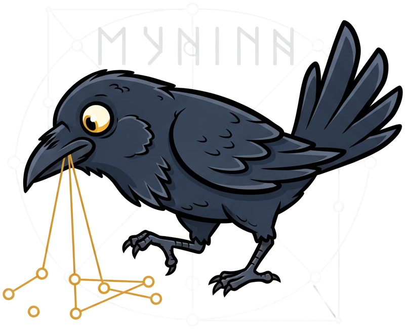

# sqlite-muninn

<div align="center">
    
    <p><i>Odin's mythic <a href="https://en.wikipedia.org/wiki/Huginn_and_Muninn">raven of Memory</a>.</i></p>
</div>

A zero-dependency C extension for SQLite to add an advanced collection of knowledge graph primitives like Vector Similarity Search, HNSW Indexes, Graph database, Centrality Measures, Community Detection, and Node2Vec capabilities.

## Features

- **HNSW Vector Index** — O(log N) approximate nearest neighbor search with incremental insert/delete
- **Graph Traversal** — BFS, DFS, shortest path, connected components, PageRank on any edge table
- **Centrality Measures** — Degree, betweenness (Brandes), and closeness centrality with weighted/temporal support
- **Community Detection** — Leiden algorithm for discovering graph communities with modularity scoring
- **Node2Vec** — Learn structural node embeddings from graph topology, store in HNSW for similarity search
- **Zero dependencies** — Pure C11, compiles to a single `.dylib`/`.so`/`.dll`
- **SIMD accelerated** — ARM NEON and x86 SSE distance functions

## Quick Start

```bash
# Build
brew install sqlite  # macOS
make all

# Run tests
make test        # C unit tests
make test-python # Python integration tests
```

```sql
.load ./muninn

-- Create an HNSW vector index
CREATE VIRTUAL TABLE my_vectors USING hnsw_index(
    dimensions=384, metric='cosine', m=16, ef_construction=200
);

-- KNN search
SELECT rowid, distance FROM my_vectors
WHERE vector MATCH ?query AND k = 10 AND ef_search = 64;

-- Graph traversal on any edge table
SELECT node, depth FROM graph_bfs
WHERE edge_table = 'friendships' AND src_col = 'user_a'
  AND dst_col = 'user_b' AND start_node = 'alice' AND max_depth = 3;

-- Betweenness centrality (find bridge nodes)
SELECT node, centrality FROM graph_betweenness
WHERE edge_table = 'friendships' AND src_col = 'user_a'
  AND dst_col = 'user_b' AND direction = 'both'
ORDER BY centrality DESC LIMIT 10;

-- Community detection (Leiden algorithm)
SELECT node, community_id, modularity FROM graph_leiden
WHERE edge_table = 'friendships' AND src_col = 'user_a'
  AND dst_col = 'user_b';
```

## Available Functions

| Function | Purpose | Output Columns |
|----------|---------|----------------|
| `graph_bfs` | Breadth-first traversal | node, depth, parent |
| `graph_dfs` | Depth-first traversal | node, depth, parent |
| `graph_shortest_path` | Shortest path (Dijkstra) | node, distance, path_order |
| `graph_components` | Connected components | node, component_id, component_size |
| `graph_pagerank` | PageRank scores | node, rank |
| `graph_degree` | Degree centrality | node, in_degree, out_degree, degree, centrality |
| `graph_betweenness` | Betweenness centrality | node, centrality |
| `graph_closeness` | Closeness centrality | node, centrality |
| `graph_leiden` | Leiden community detection | node, community_id, modularity |
| `node2vec_train()` | Graph embedding generation | (scalar: nodes embedded) |
| `hnsw_index` | HNSW vector virtual table | rowid, vector, distance |

See the [full API reference](api.md) and [benchmark results](benchmarks.md) for details.
